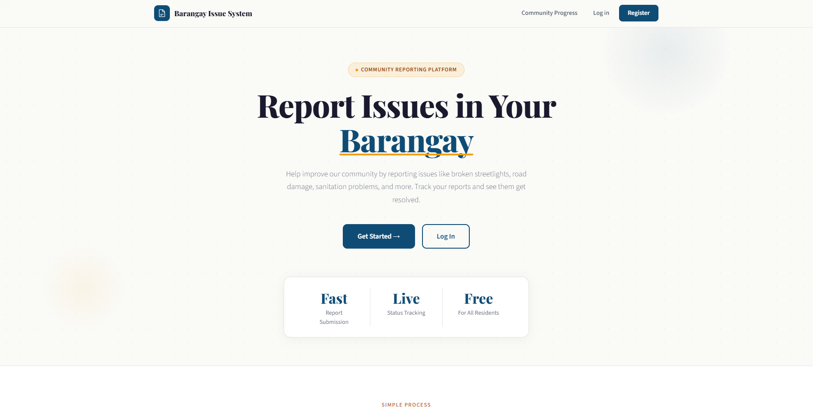
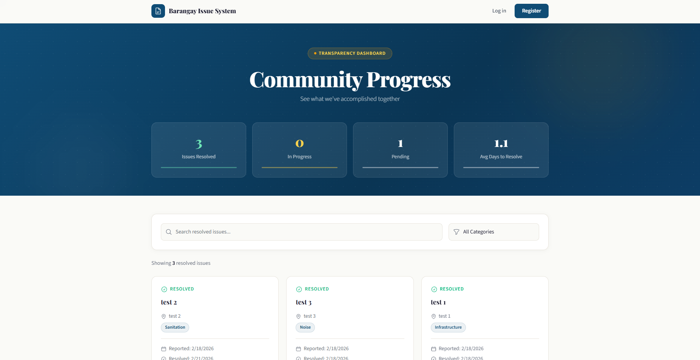
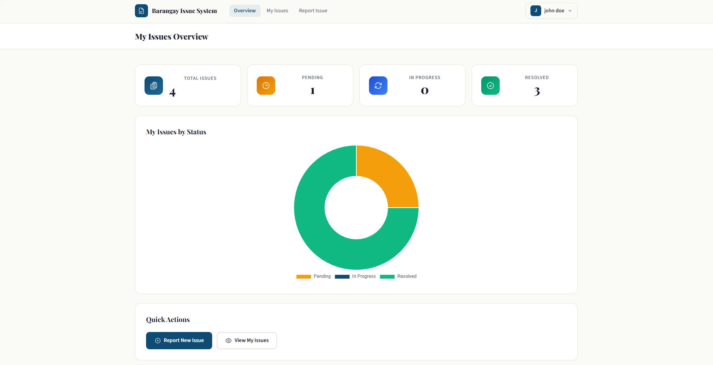
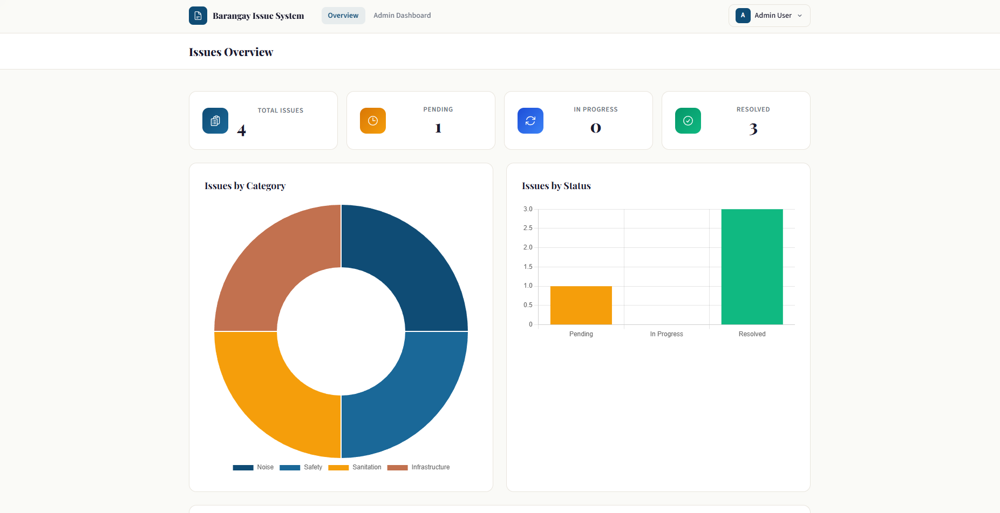

# Barangay Issue Reporting System

A web-based issue reporting system for barangay communities to report and track local issues like infrastructure problems, sanitation concerns, safety issues, and more.

## Features

### For Users (Residents)
- **Report Issues**: Submit complaints with detailed descriptions, location, and category
- **Photo Upload**: Attach up to 3 photos per issue for visual evidence
- **Track Issues**: View all your submitted issues and their current status
- **Dashboard**: Personal dashboard showing statistics of your reported issues

### For Admins (Barangay Officials)
- **View All Issues**: See all issues reported by all users
- **Update Status**: Change issue status (Pending → In Progress → Resolved)
- **Add Notes**: Leave admin notes explaining actions taken
- **Dashboard with Analytics**: Visual charts showing issue statistics, trends, and category breakdowns
- **Photo Review**: View all photos attached to issues

### Public Features
- **Community Progress**: Public page showing all resolved issues
- **Transparency**: See what's been accomplished in the community
- **Statistics**: View overall barangay issue resolution metrics

## Tech Stack

- **Backend**: Laravel 11 (PHP)
- **Frontend**: Vue 3 with TypeScript
- **Bridge**: Inertia.js
- **Styling**: Tailwind CSS
- **Database**: PostgreSQL
- **Charts**: Chart.js
- **Icons**: Heroicons

## Categories

- Infrastructure
- Sanitation
- Safety
- Noise
- Environment
- Other

## Issue Status Flow

1. **Pending** - Newly submitted, awaiting review
2. **In Progress** - Being worked on by barangay officials
3. **Resolved** - Issue has been fixed/addressed

## 📸 Screenshots

### 🏠 Home Screen
The public-facing landing page where residents can learn about the platform and get started.

---

### 🌍 Community Progress
A public transparency dashboard showing resolved issues and overall community statistics — no login required.

---

### 👤 User Dashboard
Logged-in residents can view their submitted issues, track statuses, and report new ones.

---

### 🛠️ Admin Dashboard
Administrators have access to a full issues overview with category and status breakdowns via charts.

---
